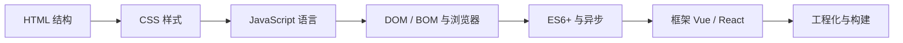

# 前端学习笔记

> 一份面向入门到进阶的前端学习笔记，覆盖 HTML、CSS、JavaScript、TypeScript、框架与工程化的核心知识点，可作为学习路线与速查手册。

---

## 一、学习路线图

前端学习建议按以下顺序循序渐进，每一层都是上一层的基础：



| 阶段 | 主题 | 目标 |
|---|---|---|
| 1 | HTML + CSS | 能独立还原静态页面，掌握布局与响应式 |
| 2 | JavaScript | 掌握语言核心、数组/对象操作、函数与闭包 |
| 3 | DOM / BOM | 操作页面元素，处理事件，与浏览器交互 |
| 4 | ES6+ / 异步 | 熟悉新语法、Promise、async/await、网络请求 |
| 5 | 框架 | 用 Vue 或 React 构建组件化单页应用 |
| 6 | 工程化 | 掌握包管理、构建工具、模块化与部署 |

---

## 二、HTML 基础

HTML（超文本标记语言）负责网页的**结构**，由标签（元素）构成。

### 2.1 文档骨架

```html
<!DOCTYPE html>
<html lang="zh-CN">
<head>
  <meta charset="UTF-8" />
  <meta name="viewport" content="width=device-width, initial-scale=1.0" />
  <title>页面标题</title>
</head>
<body>
  <!-- 页面内容 -->
</body>
</html>
```

### 2.2 常用标签

| 标签 | 用途 |
|---|---|
| `<h1>` ~ `<h6>` | 标题，层级递减 |
| `<p>` | 段落 |
| `<a href="...">` | 超链接 |
| `` | 图片 |
| `<ul>` / `<ol>` / `<li>` | 无序 / 有序列表 |
| `<div>` / `<span>` | 无语义容器（块级 / 行内） |
| `<table>` | 表格 |
| `<form>` | 表单 |

### 2.3 语义化标签

| 标签 | 含义 |
|---|---|
| `<header>` | 页眉 |
| `<nav>` | 导航 |
| `<main>` | 主体内容 |
| `<article>` | 独立文章 |
| `<section>` | 章节 |
| `<aside>` | 侧边栏 |
| `<footer>` | 页脚 |

> 语义化标签有助于搜索引擎理解页面结构与无障碍访问。

---

## 三、CSS 基础

CSS 负责网页的**表现**（样式），通过选择器选中元素并应用样式。

### 3.1 三种引入方式

```html
<!-- 1. 内联样式 -->
<p style="color: red;">文字</p>

<!-- 2. 内部样式表 -->
<style>
  p { color: red; }
</style>

<!-- 3. 外部样式表（推荐） -->
<link rel="stylesheet" href="style.css" />
```

### 3.2 选择器

| 选择器 | 语法 | 说明 |
|---|---|---|
| 标签选择器 | `p` | 选中所有 p |
| 类选择器 | `.box` | 选中 class="box" |
| ID 选择器 | `#app` | 选中 id="app"（唯一） |
| 后代选择器 | `.box span` | box 内部所有 span |
| 子代选择器 | `.box > span` | 直接子级 span |
| 伪类选择器 | `a:hover` | 悬停状态 |
| 属性选择器 | `[type="text"]` | 按属性匹配 |

### 3.3 盒模型

每个元素都是一个矩形盒子，由内到外：

```
margin（外边距） → border（边框） → padding（内边距） → content（内容）
```

```css
.box {
  width: 200px;
  padding: 10px;
  border: 1px solid #ccc;
  margin: 20px;
  box-sizing: border-box; /* 让 width 包含 padding 和 border */
}
```

### 3.4 布局方式

| 布局 | 核心属性 | 适用场景 |
|---|---|---|
| 普通流 | `display: block / inline` | 默认文档流 |
| Flexbox | `display: flex` | 一维布局（行 / 列） |
| Grid | `display: grid` | 二维布局（网格） |
| 定位 | `position: relative / absolute / fixed / sticky` | 覆盖、固定定位 |
| 响应式 | `@media` 媒体查询 | 适配不同屏幕 |

```css
/* Flex 水平居中示例 */
.container {
  display: flex;
  justify-content: center; /* 主轴居中 */
  align-items: center;     /* 交叉轴居中 */
}

/* Grid 三列等分布局 */
.grid {
  display: grid;
  grid-template-columns: repeat(3, 1fr);
  gap: 16px;
}
```

---

## 四、JavaScript 基础

JavaScript 负责网页的**行为**，是前端开发的核心语言。

### 4.1 变量声明

```js
// 旧语法：函数作用域，可变
var name = 'old';

// 新语法：块级作用域
let age = 18;      // 可重新赋值
const PI = 3.14;   // 常量，不可重新赋值（推荐优先使用）
```

### 4.2 数据类型

| 类型 | 示例 | 说明 |
|---|---|---|
| `number` | `1`, `3.14` | 数字 |
| `string` | `'hello'` | 字符串 |
| `boolean` | `true` / `false` | 布尔 |
| `null` | `null` | 空值 |
| `undefined` | `undefined` | 未定义 |
| `object` | `{ name: 'a' }` | 对象（含数组、函数） |
| `symbol` | `Symbol()` | 唯一值 |
| `bigint` | `10n` | 大整数 |

### 4.3 数组常用方法

```js
const arr = [1, 2, 3, 4, 5];

arr.map(x => x * 2);        // [2,4,6,8,10] 映射
arr.filter(x => x > 2);     // [3,4,5] 过滤
arr.reduce((a, b) => a + b); // 15 累加
arr.find(x => x === 3);     // 3 查找
arr.some(x => x > 4);       // true 是否有满足
arr.forEach(x => console.log(x)); // 遍历
arr.includes(2);            // true 是否包含
```

### 4.4 对象操作

```js
const user = { name: 'Tom', age: 18 };

// 访问
user.name;      // 点语法
user['age'];    // 方括号语法

// 解构
const { name, age } = user;

// 展开
const copy = { ...user, city: '北京' };
```

### 4.5 函数

```js
// 函数声明
function add(a, b) { return a + b; }

// 箭头函数（无自己的 this）
const add2 = (a, b) => a + b;

// 默认参数
function greet(name = '朋友') { return `你好，${name}`; }
```

---

## 五、ES6+ 常用特性

### 5.1 模板字符串

```js
const name = 'Tom';
const msg = `你好，${name}`; // 反引号 + 插值
```

### 5.2 解构赋值

```js
const [a, b] = [1, 2];          // 数组解构
const { x, y } = { x: 1, y: 2 }; // 对象解构
```

### 5.3 展开运算符

```js
const arr = [1, 2, 3];
const arr2 = [...arr, 4];        // [1,2,3,4]
const obj = { ...{ a: 1 }, b: 2 }; // { a:1, b:2 }
```

### 5.4 模块化

```js
// 导出（export）
export const name = 'Tom';
export default function () {}

// 导入（import）
import defaultFn, { name } from './module.js';
```

### 5.5 可选链与空值合并

```js
const city = user?.address?.city;   // 可选链，安全访问
const val = a ?? '默认值';          // 仅当 a 为 null/undefined 时取默认
```

---

## 六、DOM 与 BOM

### 6.1 DOM 查询与操作

```js
// 查询
const el = document.querySelector('.box');    // 单个
const els = document.querySelectorAll('li');  // 全部

// 修改内容
el.textContent = '文本';     // 纯文本
el.innerHTML = '<b>加粗</b>'; // HTML（注意 XSS）

// 修改样式
el.style.color = 'red';
el.classList.add('active'); // 切换类

// 增删元素
const node = document.createElement('div');
el.appendChild(node);
el.remove();
```

### 6.2 事件处理

```js
// 事件监听
button.addEventListener('click', (e) => {
  console.log('点击了', e.target);
});

// 常见事件
// click 点击 / input 输入 / change 变更 / submit 提交
// keydown 按键 / mouseenter 鼠标进入 / load 加载
```

### 6.3 事件委托

利用事件冒泡，把子元素事件统一绑定到父元素，提升性能：

```js
list.addEventListener('click', (e) => {
  if (e.target.tagName === 'LI') {
    console.log('点击了列表项', e.target.textContent);
  }
});
```

### 6.4 BOM 常用对象

| 对象 | 用途 |
|---|---|
| `window` | 全局对象 |
| `location` | 当前 URL，跳转 |
| `history` | 前进 / 后退 |
| `navigator` | 浏览器信息 |
| `localStorage` | 本地持久化存储 |
| `sessionStorage` | 会话级存储 |

---

## 七、异步编程

### 7.1 回调函数

```js
setTimeout(() => {
  console.log('1 秒后执行');
}, 1000);
```

### 7.2 Promise

```js
const p = new Promise((resolve, reject) => {
  // 异步操作
  if (成功) resolve(数据);
  else reject(错误);
});

p.then(数据 => console.log(数据))
 .catch(错误 => console.error(错误))
 .finally(() => console.log('结束'));
```

### 7.3 async / await（推荐）

```js
async function fetchData() {
  try {
    const res = await fetch('/api/data');
    const data = await res.json();
    console.log(data);
  } catch (err) {
    console.error('请求失败', err);
  }
}
```

### 7.4 网络请求

```js
// fetch API
fetch('/api/users', {
  method: 'POST',
  headers: { 'Content-Type': 'application/json' },
  body: JSON.stringify({ name: 'Tom' })
})
  .then(res => res.json())
  .then(data => console.log(data));
```

---

## 八、前端框架

### 8.1 Vue 3（组合式 API）

```js
import { ref, computed, onMounted } from 'vue';

const count = ref(0);                       // 响应式数据
const double = computed(() => count.value * 2); // 计算属性

function increment() { count.value++; }

onMounted(() => {                            // 生命周期
  console.log('组件挂载完成');
});
```

### 8.2 React（函数组件 + Hooks）

```jsx
import { useState, useEffect } from 'react';

function Counter() {
  const [count, setCount] = useState(0);     // 状态

  useEffect(() => {                          // 副作用
    document.title = `点击了 ${count} 次`;
  }, [count]);

  return (
    <button onClick={() => setCount(count + 1)}>
      点击了 {count} 次
    </button>
  );
}
```

### 8.3 选型建议

| 框架 | 特点 | 适合 |
|---|---|---|
| Vue | 上手快、中文资料多、模板语法直观 | 中小项目、国内团队 |
| React | 生态庞大、JSX、灵活 | 大型应用、跨端（React Native） |

> 建议先精通一个框架，再触类旁通。国内就业市场 Vue 需求旺盛，React 在外企与大厂同样主流。

---

## 九、TypeScript 类型系统

TypeScript 是 JavaScript 的超集，为 JS 添加了**静态类型系统**，在编译期发现类型错误，已成为现代前端项目的标配。

### 9.1 为什么用 TypeScript

- 编译期发现错误，减少运行时 bug
- IDE 提供更智能的补全与跳转
- 代码即文档，类型即注释
- 重构更安全

### 9.2 基础类型

```ts
// 原始类型
const name: string = 'Tom';
const age: number = 18;
const active: boolean = true;

// 数组
const nums: number[] = [1, 2, 3];
const strs: Array<string> = ['a', 'b'];

// 元组
const pair: [string, number] = ['Tom', 18];

// 联合类型
let val: string | number = 'a';
val = 1; // 也允许

// 字面量类型
type Direction = 'up' | 'down' | 'left' | 'right';
```

### 9.3 接口与类型别名

```ts
// interface
interface User {
  name: string;
  age: number;
  readonly id: number;    // 只读
  email?: string;         // 可选
  [key: string]: unknown; // 索引签名
}

// type
type Status = 'active' | 'inactive';
type Point = { x: number; y: number };

// 继承
interface Admin extends User {
  role: 'admin';
}
```

### 9.4 泛型

泛型让类型可参数化，复用同一段代码处理多种类型：

```ts
function identity<T>(value: T): T {
  return value;
}

const a = identity<string>('hello'); // 显式指定
const b = identity(42);              // 自动推断

// 泛型接口
interface ApiResult<T> {
  code: number;
  data: T;
}

const userResult: ApiResult<User> = { code: 0, data: { name: 'Tom', age: 18, id: 1 } };
```

### 9.5 常用工具类型

| 类型 | 作用 |
|---|---|
| `Partial<T>` | 所有属性变为可选 |
| `Required<T>` | 所有属性变为必选 |
| `Readonly<T>` | 所有属性变为只读 |
| `Pick<T, K>` | 挑选指定属性 |
| `Omit<T, K>` | 排除指定属性 |
| `Record<K, V>` | 创建键值映射类型 |

```ts
interface User { name: string; age: number; email: string; }
type UserPreview = Pick<User, 'name' | 'email'>; // { name; email }
type UserPatch  = Partial<User>;                  // 全可选
```

### 9.6 在项目中使用

```bash
# 安装
npm install -D typescript

# 初始化
npx tsc --init

# 类型检查（不输出文件）
npx tsc --noEmit
```

`tsconfig.json` 关键字段：

```json
{
  "compilerOptions": {
    "target": "ES2020",
    "module": "ESNext",
    "strict": true,
    "jsx": "preserve",
    "esModuleInterop": true,
    "skipLibCheck": true
  },
  "include": ["src/**/*"]
}
```

### 9.7 学习建议

1. 先用宽松模式（`strict: false`）上手，再逐步开启严格模式
2. 优先理解**类型推断**，不要到处显式标注
3. 熟悉 `any` / `unknown` / `never` 的区别：**能用 `unknown` 就不用 `any`**
4. 多读优秀开源项目的类型定义（如 Vue / React 的 .d.ts）

---

## 十、工程化与工具链

### 9.1 包管理器

```bash
npm install <pkg>        # 安装依赖
npm install -D <pkg>     # 安装开发依赖
npm run <script>         # 运行脚本
```

### 9.2 构建工具

| 工具 | 用途 |
|---|---|
| Vite | 新一代前端构建工具，启动快 |
| Webpack | 老牌打包器，生态成熟 |
| esbuild | 极速打包器 |
| Babel | ES6+ 语法转译 |

### 9.3 常用工程化概念

| 概念 | 说明 |
|---|---|
| 模块化 | ESM（import/export）组织代码 |
| 代码规范 | ESLint（JS/TS）、Prettier（格式化） |
| 类型系统 | TypeScript，为 JS 增加静态类型 |
| 版本管理 | Git + 远程仓库（GitHub / Gitee） |
| 部署 | 静态托管（Vercel / Netlify / GitHub Pages） |

---

## 十一、学习资源与建议

### 10.1 推荐资源

| 类型 | 资源 |
|---|---|
| 文档 | MDN Web Docs（权威）、Vue / React 官方文档 |
| 教程 | freeCodeCamp、菜鸟教程、现代 JavaScript 教程 |
| 练习 | LeetCode、前端练习场、做几个完整项目 |
| 社区 | GitHub、掘金、SegmentFault |

### 10.2 学习建议

1. **动手优先**：每学一个知识点就写一段可运行的代码。
2. **从做项目入手**：完成一个个人项目（如待办清单、个人主页、天气应用）。
3. **多看源码与文档**：官方文档是最权威的第一手资料。
4. **持续积累**：关注前端新特性，但先把基础打牢。
5. **构建作品集**：把练手项目放到 GitHub，形成自己的作品集。

> 前端学习重在实践与坚持，每天进步一点点，日积月累就能独立完成一个完整的 Web 应用。
